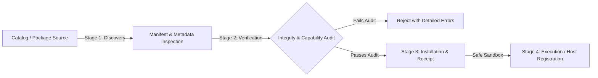

# ADR-018: Plugin Ecosystem, Catalog, and Marketplace Foundation Contract

## Status

Accepted (Phase 14)

## Context

VERIS V2 establishes an extension architecture for external extractors and declarative rule packs. As the ecosystem expands, users and organizations require a secure, offline-first mechanism to discover, audit, verify, install, and uninstall plugins without compromising deterministic analysis, reproducible builds, or zero-trust boundaries.

In accordance with VERIS core invariants:

1. **Offline-First & Air-Gapped**: Registry catalogs and plugin packages operate entirely locally from filesystems, offline directories, or enterprise mirrors without mandatory network connectivity.
2. **Deterministic Lifecycle Separation**: Plugin lifecycles must be strictly segregated into sequential stages:
   $$\text{DISCOVERY} \longrightarrow \text{VERIFICATION} \longrightarrow \text{INSTALLATION} \longrightarrow \text{EXECUTION}$$
3. **Declarative Purity & Zero Untrusted Code**: Rule pack plugins must remain 100% declarative data. Discovery, catalog browsing, and package verification must never execute untrusted plugin code.
4. **Zero-Trust Capability Auditing**: Every capability declared by a plugin (`network`, `process-spawn`, `target-read`, `fs-write-output`) must be explicitly audited and categorized before installation. Dangerous capabilities must trigger high-visibility security warnings.

## Architecture

### 1. Catalog Schema (`PluginCatalog`)

A catalog is a signed or immutable JSON manifest listing verified plugin packages:

- `schemaVersion`: Must be `"1.0.0"`.
- `name`: Catalog name (e.g., `"VERIS Standard Ecosystem Catalog"`).
- `updatedAt`: ISO 8601 generation timestamp.
- `packages`: Array of `PluginPackageRecord` objects.

Each `PluginPackageRecord` specifies:

- `id`: Globally unique scoped or unscoped identifier (e.g., `@veris/plugin-office-pe`, `community-aws-rules`).
- `name`: Human-readable display title.
- `version`: Strict SemVer version string.
- `description`: Plaintext summary of functionality.
- `type`: `"extractor"` or `"rule-pack"`.
- `author`: Entity or maintainer identity.
- `license`: Valid SPDX license expression.
- `capabilities`: Array of declared `PluginCapability` flags.
- `sha256`: Hexadecimal SHA-256 hash of the package contents.
- `engines`: Minimum and maximum compatible VERIS host versions (`engines.veris`).
- `location`: Relative or local path to package bundle directory or archive.
- `tags`: Categorical metadata tags.

### 2. Four-Stage Lifecycle Pipeline



#### Stage 1: Discovery

- Traverses local directories or catalog records.
- Locates manifest files (`veris-plugin.json`, `plugin.json`, or `package.json#veris`).
- Performs read-only schema validation without executing any scripts (`scripts`, `postinstall`, or module imports are strictly prohibited).

#### Stage 2: Verification (`verifyPluginPackage`)

The verification pipeline performs four deterministic checks:

1. **Manifest Authenticity**: Schema compliance, required fields, and structural validity.
2. **Integrity Checksum (SHA-256)**: Canonical tree hash over all package files. Detects any post-release file tampering or corruption.
3. **Host Compatibility**: SemVer range evaluation (`engines.veris`) against the running VERIS host version.
4. **Security & Capability Auditing**:
   - Identifies and flags dangerous capabilities (`network`, `process-spawn`).
   - Verifies rule packs contain zero executable code files.
   - Enforces path containment (prevents directory traversal `../` and symlink escapes).

#### Stage 3: Installation (`installPluginPackage`)

- Hard gate: Only packages that achieve 100% verification success can be installed.
- Sanitizes destination directory name using strictly validated plugin ID.
- Copies package assets atomically into the target plugins directory (`<targetDir>/<pluginId>`).
- Writes an immutable installation receipt (`.veris-installed.json`) recording:
  - Installed timestamp
  - Package version and verified SHA-256 hash
  - Declared capabilities snapshot

#### Stage 4: Execution & Management (`removePluginPackage`)

- Plugin Host loads installed plugins from the plugin directory using the isolated sandbox.
- Users can inspect installed packages using `veris plugins list` and `veris plugins info`.
- Users can cleanly uninstall packages using `veris plugins remove <plugin-id>`, which verifies directory ownership and safely removes the package files.

### 3. CLI Contracts

```
veris plugins catalog [catalog-path] [--type <type>] [--search <query>] [--json]
veris plugins verify <package-path> [--expected-sha256 <hash>] [--json]
veris plugins install <package-path> [--target <dir>] [--force] [--json]
veris plugins remove <plugin-id> [--target <dir>] [--json]
```

### 4. Security & Determinism Invariants

- **No Remote Network Requests**: Catalogs and packages are resolved from local paths, filesystem directories, or local air-gapped bundles.
- **Tampering Resistance**: SHA-256 checksums are calculated deterministically across sorted file relative paths and byte contents.
- **Fail-Closed Verification**: Any discrepancy in checksum, missing manifest field, or version incompatibility results in immediate exit code failure (`1`) without modifying the filesystem.
